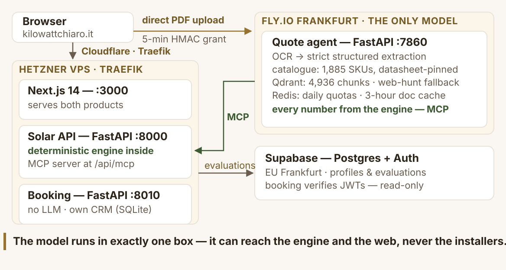

# KiloWattChiaro

> **The independent check on the solar purchase.**
> Live and free at **[kilowattchiaro.it](https://kilowattchiaro.it)**.

[](https://github.com/domenicodigangi/kilowattchiaro/actions/workflows/ci.yml)
[](https://pypi.org/project/kilowattchiaro-engine/)
[](LICENSE.md)

An Italian homeowner considering rooftop solar has two questions nobody
neutral will answer: **is solar worth it for my house?** and **is this
quote fair?** The market's default path runs through lead aggregators
that resell your phone number to competing installers — everyone you can
ask gets paid if you say yes.

KiloWattChiaro is the neutral answer: a **deterministic evaluation
engine** with a fully published methodology, an **agentic quote
reviewer** that must back every technical claim with a manufacturer
datasheet citation, and a hard architectural wall between the check and
the sale — a *"solar is not worth it for your roof"* verdict is a
first-class result, presented exactly like a yes.

## What's in this repository

This repo publishes the part of the product whose entire value is being
inspectable — the code that computes every number a homeowner sees:

| Public — this repo | Private — the product |
|---|---|
| `src/kilowattchiaro_engine/` — the deterministic evaluation engine, **exactly as deployed in production** (NPV, IRR, payback, hourly self-consumption, price scenarios, historical backtests) | Web app, HTTP service layer, persistence |
| `tests/` — 124 tests: unit, stress, validation, and backtests across the 2011–2025 Italian incentive regimes | Booking service (separate system, no AI in it) |
| [`docs/methodology.md`](docs/methodology.md) — the full methodology: every formula and every assumption, with values | Quote-agent runtime — [public source snapshot](https://github.com/domenicodigangi/kilowattchiaro-agent) |
| [`docs/architecture.md`](docs/architecture.md) — system design, runtime + delivery diagrams | Component catalogue & price-benchmark data ([open rubric CSV](https://kilowattchiaro.it/open-data) is CC BY 4.0) |
| [`docs/quote-engine.md`](docs/quote-engine.md) — design of the quote-fairness engine (description + skeleton, deliberately not runnable) | Infrastructure (IaC, deploy, secrets) |
| [`docs/deck.pdf`](docs/deck.pdf) — the slides from the Demo Day video, appendices included | CRM and installer-partner data |

## The pitch

- **[`docs/deck.pdf`](docs/deck.pdf)** — 15 pages: the twelve slides from
  the video, plus three appendices that are not spoken in it (why a
  general-purpose chatbot cannot do this, how the citation gate works, and
  the push-to-production delivery pipeline).
- **[`docs/deck.html`](docs/deck.html)** — the same deck, interactive and
  self-contained: download the raw file and open it in a browser. Arrow
  keys navigate, `End` jumps to the last spoken slide, and the three
  appendices follow it.

Both are generated, script-free copies of the presenter deck: the speaker
notes and the narration are stripped at build time, and
[`tests/test_published_deck.py`](tests/test_published_deck.py) fails the
build if a copy still carrying them is ever committed here.

## Install

```bash
pip install kilowattchiaro-engine
# or, from source:
pip install git+https://github.com/domenicodigangi/kilowattchiaro
```

Python ≥ 3.11. Dependencies: `pydantic`, `pydantic-settings` — nothing else.

## Quickstart

Evaluate a typical Roman household (3,000 kWh/year) putting 6 kWp on the
roof, with a 10 kWh battery:

```python
from kilowattchiaro_engine import evaluate_solar
from kilowattchiaro_engine.models.solar_eval import ConsumptionProfile, PVGISMonthly

consumption = ConsumptionProfile(
    annual_kwh=3000, f1_kwh=1200, f2_kwh=1050, f3_kwh=750, annual_cost_eur=750.0,
)

# Monthly production for 6 kWp in Rome (kWh) — normally fetched from PVGIS
production = [
    PVGISMonthly(month=m, e_m=e, h_m=h)
    for m, e, h in [
        (1, 450, 3.0), (2, 520, 3.5), (3, 720, 4.5), (4, 830, 5.2),
        (5, 950, 6.0), (6, 1000, 6.5), (7, 1050, 6.8), (8, 980, 6.3),
        (9, 780, 5.0), (10, 600, 4.0), (11, 420, 3.0), (12, 380, 2.5),
    ]
]

result = evaluate_solar(
    consumption=consumption,
    monthly_production=production,
    desired_kwp=6.0,
    include_battery=True,
    battery_kwh=10.0,
)

for s in result.scenarios:
    print(f"{s.label:22} NPV 20y: {s.npv_20yr_eur or 0:>9,.0f} €   "
          f"payback: {s.payback_years or float('inf'):>5.1f} y   "
          f"annual savings: {s.annual_savings_eur:>7,.0f} €")
```

Every assumption behind those numbers is a named, overridable setting
(`KWC_ENGINE_*` environment variables — see
[`src/kilowattchiaro_engine/config.py`](src/kilowattchiaro_engine/config.py))
and is documented with its value in the
[assumptions register](docs/methodology.md#12-registro-delle-assunzioni).

## Why deterministic

Large language models do approximate arithmetic; money math shouldn't
be approximate. In KiloWattChiaro **a model runs in exactly one place**
— the quote agent that reads unstructured PDFs — and even there, every
number it states comes from this engine over MCP: same inputs, same
answer, and anyone can check the logic because the logic is this
repository.



The second invariant is drawn in the diagram: the engines that judge
your roof and your quote don't know the installers exist. The booking
service is a separate system with no AI in it; the only thing that
crosses the separation is the homeowner's own click. The check cannot
favor the sale.

More in [`docs/architecture.md`](docs/architecture.md) — including the
delivery pipeline (tests and an eval gate on every change, among them a
fault-injection eval that fails the build if a fabricated datasheet is
ever cited).

## Tests

```bash
pip install -e '.[dev]'
pytest
```

124 tests in four suites: engine unit tests, numerical stress tests
(zero/near-zero edge cases), validation against reference outcomes, and
historical backtests replaying every Italian incentive regime from 2011
to 2025.

## Related

- **[kilowattchiaro.it](https://kilowattchiaro.it)** — the live product:
  solar evaluation (free, no account), quote check and booking (free, a
  sign-up).
- **[kilowattchiaro-agent](https://github.com/domenicodigangi/kilowattchiaro-agent)**
  — public source snapshot of the agentic quote reviewer (LangGraph, MCP,
  Qdrant, citation-gated RAG, eval harness).
- **[Open data](https://kilowattchiaro.it/open-data)** — datasets under
  CC BY 4.0, including the photovoltaic price rubric.

## License

**Source-available** — read, run, and verify freely; commercial use or
redistribution requires written permission. See [LICENSE.md](LICENSE.md).
This is a published package, deliberately not open source: transparency
is the point, the product is the business.

## Author

**Domenico Di Gangi** — solo founder, Pisa, Italy. KiloWattChiaro is
built and operated end-to-end by one person: product, engine, agent,
infrastructure.

Contact: **kilowattchiaro@gmail.com**
