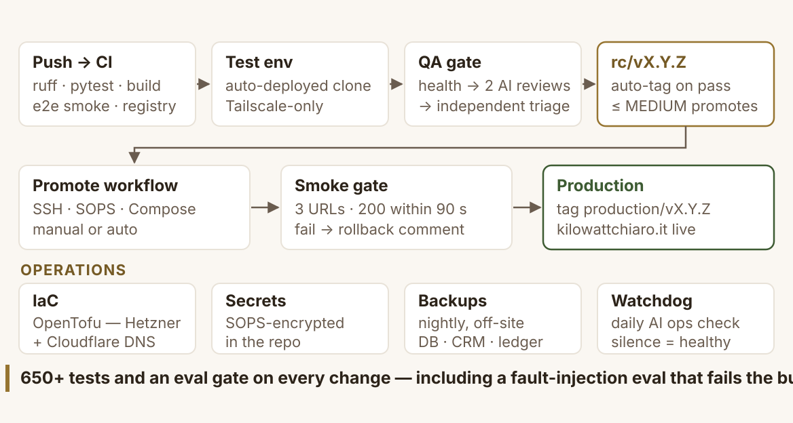

# Architecture

How KiloWattChiaro runs in production, and how changes reach it. The two
diagrams below are the same ones used in the demo-day deck; every fact on
them is current as of August 2026.

## Runtime — one VPS, one agent, one wall


**The main box is a single European VPS** (Hetzner, Falkenstein), fronted
by Cloudflare and routed internally by Traefik, running three containers
under Docker Compose:

- **Next.js 14** (`:3000`) — the web app at
  [kilowattchiaro.it](https://kilowattchiaro.it).
- **Solar API — FastAPI** (`:8000`) — the service layer around the
  [deterministic engine published in this repository](../src/kilowattchiaro_engine/).
  It also exposes an **MCP server** at `/api/mcp` (`solar_evaluate_v2`,
  `quote_compare_v1`), so agents can call the engine as a tool instead of
  doing arithmetic themselves.
- **Booking — FastAPI** (`:8010`) — a deliberately separate service with
  **no LLM in it** and its own store (SQLite CRM). It verifies user
  identity against Supabase read-only and never touches the evaluation
  database.

**The quote agent** runs elsewhere on purpose — Fly.io Frankfurt
(`:7860`): OCR → strict structured extraction, component resolution
against a curated, datasheet-pinned catalogue (1,885 SKUs), Qdrant
retrieval over ~4,900 indexed datasheet chunks, a web-hunt fallback for
unknown components, and Redis for daily quotas and a short document
cache. Quote PDFs upload **directly from the browser to Fly** under a
five-minute HMAC grant — pseudonymous: Fly never receives the Supabase
identity, and the browser never sees the service credential.

**Supabase** (Frankfurt, AWS eu-central-1) holds Postgres and auth —
user profiles and evaluations.

### The two invariants the diagram encodes

1. **The model runs in exactly one box.** The quote agent is the only
   place an LLM executes, and every number it states comes from the
   deterministic engine over MCP — same inputs, same answer. The engine
   itself has no model in it (you can read all of it in this repo).
2. **The check cannot favor the sale.** The engines that judge a roof or
   a quote don't know the installers exist. The booking service is a
   separate system; the only thing that crosses the separation is the
   homeowner's explicit click, carrying their evaluation to the one
   installer they named. A negative verdict is a full result.

## Delivery — from push to production



Every push runs CI: 650+ tests across backend, frontend, agent, and E2E,
plus an **eval gate** on the agent (SKU-resolution and web-evidence
admission benchmarks; a fault-injection suite feeds the agent fabricated
datasheets and fails the build if fabricated content is ever cited).
Green CI auto-deploys to a **test environment reachable only over
Tailscale**, where a three-stage QA gate runs before a release candidate
is tagged. Production is a **manual promotion** of a tagged RC, followed
by an automatic smoke gate on the live URLs. Infrastructure is OpenTofu;
secrets are SOPS-encrypted in-repo.

## Where this repository fits

```
public                                   private
──────────────────────────────────────   ─────────────────────────────────
this repo                                watt-chiaro monorepo
  kilowattchiaro-engine (the math)   ◄── service layer imports the engine
  methodology, diagrams, docs            web app · booking · agent runtime
                                         catalogue data · infra · deploy
kilowattchiaro-agent (source snapshot)◄─ agent/ subtree, minus data
```

The engine package is the exact code in production; the private service
layer contributes only I/O — HTTP connectors (PVGIS, Google Solar),
persistence, auth, and orchestration.
